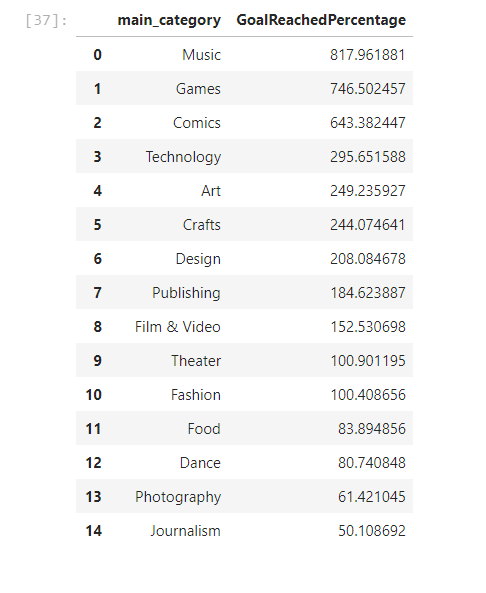
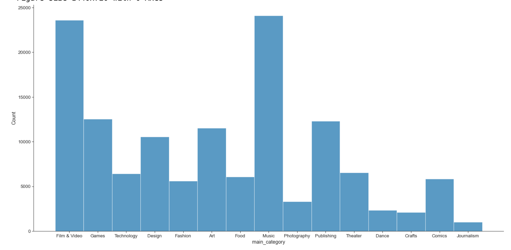
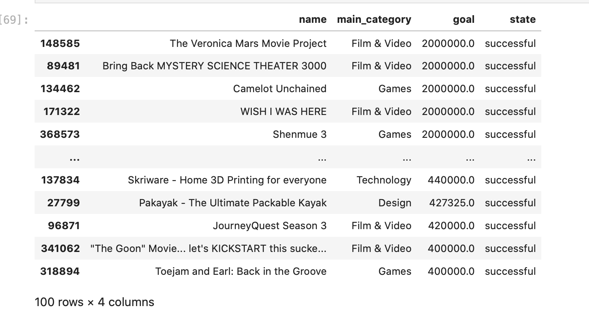
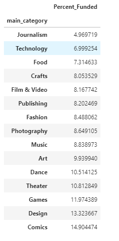
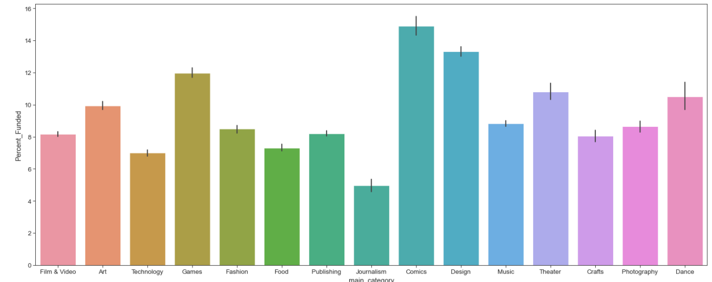

## TASK 5 - ANALYSIS
---
**Which Kickstarter categories are the most successful ?**

Our research question  was focused on analyzing a dataset with over 300,000 Kickstarter campaigns . The aim of our analysis was to understand which categories found the most success.   

We  measured success by obtaining data  such as average funding, number of successful campaigns, and number of backers. 

  

**1.	Average Funding** 

In this table we obtained the average funding per category of products . One can see that the number one category is Music with an average funding of around 818%. This means that on average campaigns that are in the Music category are pledged 8 times more than their goal. 

  

**2.	Number of successful campaigns**

  

  

  
In the graph above you can see the total number of successful campaign per product category.  In the data summary  Music is clearly identified  as the number one category with 133851 campaigns successfully completed. 

**3.	Number of backers**

  
In this graph you can see the average  number of backers that each product category has. Games is the highest with 321 backers per campaign on average.
  
**4.	Failed Projects**

Unfortunately, many kickstarters fail to reach their target goal and our research has shown us which categories are most likely to fail. It appears that Film & Video kickstarters tend to have a very tough time reaching a state of completion as shown in the image below:

As you can see, of the 197611 failed kickstarters in our dataset, 32891 of those were Film & Video projects. We also looked at the average goal reached percentage of each failed project for each category:

Out of all the failed projects, our research has shown us that when Journalism, Tech, or Food kickstarters fail, they tend to fail by a very large margin. Here is a graph representation of the data:

### Conclusion

Kickstarter is an incredibly useful tool to gain funding for various projects. However, many projects do not gain the funding they require and ultimately they fail. Our research is aimed at giving our readers an idea of which projects are likely to succeed and which ones may be doomed for failure. Over the course of our analysis we have shown that Music, Games, and Comics are among the categories that receive far more funding than they requested with Music projects being the most likely to hit their crowdfunding goals. In terms of backers, Games have a strong lead when it comes to bringing people in while Design and Technology also do quite well in this regard. Lastly, we looked at the failed projects to get a better understanding of which categories are most likely to fail as well as how much funding they tend to receive compared to what their goals were. Our research has shown that while Film & Video take up 3 spots out of the top 5 most
pledged projects, this category also takes the spot as the most likely to fail with 32,891 out of the 197,611 failed projects being under Film & Video category. If we look at the percentage of funding received for all failed projects it appears that Journalism, technology, and Food tend to miss the mark by the most. If you are looking to start your own kickstarter project in the future, this analysis shows that you should probably aim for a project that falls under the Music, Games or Comics categories. 

